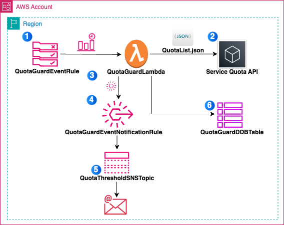
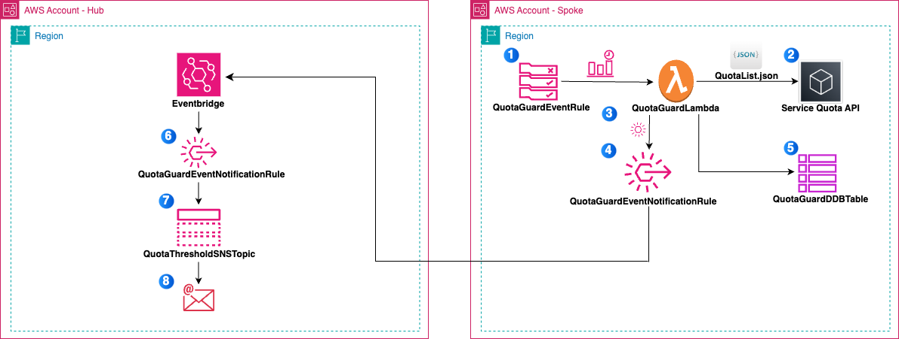

# QuotaGuard - Using Automation for AWS Service Quota management


## Introduction

Managing AWS service quotas effectively is crucial for maintaining operational continuity and preventing unexpected disruptions to business-critical applications. While AWS provides native solutions like Service Quotas and Trusted Advisor for limit monitoring, organizations often face challenges in implementing comprehensive quota management strategies, particularly for resources not covered by these services. AWS provides a [Quota Monitor solution](https://aws.amazon.com/solutions/implementations/quota-monitor/) which allows customers to manage several AWS service Quotas. However there are quotas which are not currently exposed through the AWS Service Quota service and cannot be managed by these solutions.

QuotaGuard solution in this repository provides an automation to manage quotas which are not captured by above solutions. It uses a flexible, pull-based model that allows customers to monitor Any AWS service quota, if they are not covered by AWS Trusted Advisor or Service Quotas. This solution empowers organizations to:


* Create custom quota monitoring templates for any AWS service
* Define and track service-specific limits using AWS API calls
* Implement automated usage monitoring and threshold alerts
* Maintain centralized visibility of all service quotas across their multi-account AWS environment
* Provide information on which resources are crossing the Service Quota threshold boundary

Whether you're managing a growing cloud infrastructure or maintaining large-scale AWS deployments, this solution provides the tools necessary for proactive quota management and operational excellence.


##
## Solution Components
QuotaGuard is a automation designed to monitor and alert on service quota usage across single or multiple AWS accounts.
It ensures proactive management of AWS resource quotas, preventing service disruptions due to quota exhaustion.

QuotaGuard provides two deployment models:

1. **Single Account Deployment**: Monitors quotas within a single AWS account.
2. **Multi-Account Deployment**: Centralized monitoring for multiple accounts in an AWS Organization using a hub-and-spoke model.

##
#### Single Account Deployment


This solution sets up quota monitoring for a single AWS account with following components, 

* QuotaGuardDDBTable - A DynamoDB table stores quota usage data.
* QuotaGuardLambda - A Lambda function periodically checks quota usage.
* QuotaGuardEventRule - EventBridge rule that triggers the Lambda function every 10 minutes.
* QuotaThresholdSnsTopic - An SNS topic sends email notifications when thresholds are exceeded.

##
#### Multi-Account Deployment

For Multi-account deployment, QuotaGuard solution is designed to facilitate centralized monitoring and alerting of AWS service quotas across multiple accounts in an AWS Organization. Solution components for multi-account setups are divided in two stacks -

* Hub Stack - The Hub Stack serves as the central management point for monitoring and alerting in multi-account setups. It is deployed in the management (or central) account of an AWS Organization.

    The management (or central) account has following solution components deployed,

    * QuotaGuardEventRule - An EventBridge rule to receive quota threshold events from spoke accounts
    * QuotaThresholdSnsTopic - An SNS topic for centralized notifications
    * CentralEventBusPolicy - Policy to allow spoke accounts to send events to the central event bus
    * QuotaGuardSpokeStackSet -  StackSet to deploy the spoke template to member accounts


* Spoke Stack - The Spoke Stack is deployed in each member account of the AWS Organization. It operates locally within each account to monitor service quotas and report threshold breaches back to the Hub account.

    The member account has following solution components deployed,

    * QuotaGuardDDBTable -  DynamoDB table to store member account quota information
    * QuotaGuardLambda -  Lambda function that checks quotas for member account and sends alerts
    * QuotaGuardEventRule -  EventBridge rule to trigger the Lambda function every 10 minutes in member account
    * CrossAccountEventBusRole -  IAM role for sending events to the central event bus in management account
    * CrossAccountQuotaEventRule -  EventBridge rule to forward quota threshold events to the central event  bus in management account

## 

## How it Works

#### Single Account Deployment




The Single Account deployment model monitors service quotas within one AWS account. The solutions works as follows,

1. **Scheduled  Monitoring**: An **EventBridge  rule** triggers the Lambda function (QuotaGuardLambda) every 10  minutes. The  Lambda function reads the configuration file (QuotaList.json) from the  specified S3 bucket to identify the quotas to monitor and their  thresholds.
2. **Quota  Data Retrieval**:  The  Lambda function queries AWS Service Quotas API to  fetch current quota usage for the specified services and regions.
3. **Threshold  Evaluation**: The  Lambda function compares the retrieved quota usage against the thresholds and if any quota exceeds its threshold, the Lambda function generates a custom  event (quota-threshold-event).
4. **Alert  Generation**: The  custom event is sent to EventBridge, which matches it against a  notification rule (QuotaGuardEventNotificationRule). The  matched event is routed to an SNS topic (QuotaThresholdSnsTopic).
5. **Administrator  Notification**: The  SNS topic sends an email notification to the administrator's email  address provided during deployment. The  email contains details about the breached quota, including service name,  region, and usage percentage.
6. **Data  Storage**: The  Lambda function stores quota usage data in a DynamoDB table (QuotaGuardDDBTable)  for tracking and analysis.


#### Multi-Account Deployment



The Multi-Account model uses a hub-and-spoke architecture to monitor quotas across multiple AWS accounts in an organization. The solutions works as follows, 

**Spoke (or member) Account Workflow**

1. **Local  Quota Monitoring**: In  each spoke account, an EventBridge rule triggers a Lambda function (QuotaGuardLambda)  every 10 minutes. The  Lambda function reads QuotaList.json from S3 to identify quotas and  thresholds for monitoring.
2. **Quota  Data Retrieval**: The  Lambda function queries AWS Service Quotas API to  fetch current quota usage for local resources.
3. **Threshold  Evaluation**: The  Lambda function compares current usage and If any quota exceeds its threshold, it generates a custom event (quota-threshold-event).
4. **Event  Forwarding to Hub**: Using  a cross-account IAM role, the custom event is sent to the central  EventBus in the hub account (or management account) via EventBridge.
5. **Data  Storage**: Quota  usage data is stored locally in a DynamoDB table (QuotaGuardDDBTable) for  tracking purposes.

**Hub Account Workflow**

6. **Centralized  Event Aggregation**: The  hub account's EventBridge receives quota-threshold-event events from all  spoke accounts. A  policy on the EventBus ensures only events from accounts within the same  AWS Organization are accepted.
7. **Notification  Rule Matching**: Events  are matched against a notification rule (QuotaGuardEventRule) that routes  them to an SNS topic (QuotaThresholdSnsTopic).
8. **Administrator  Notification**: The  SNS topic sends notifications to administrators with details  about breached quotas across all accounts. Notifications  include information such as account ID, service name, region, and usage  percentage.


##
## Getting Started

#### Single Account Deployment

For single account setup,

1. Clone / Copy github Repo (add repo link)
2. Create a S3 bucket for the solution resources and create a folder named "qg-templates" in the bucket
3. Create  your SSO profile as specified in the document “[Configuring IAM Identity Center authentication with the AWS CLI”](https://docs.aws.amazon.com/cli/latest/userguide/cli-configure-sso.html) upload the resources to this S3 bucket using the below command
4. Use the below command to upload resources to the bucket and deploy the stack

  ```./deploy.sh -h```

  ```Usage: $0 [OPTIONS]```
 
  ```Deploy CloudFormation stack for Quota Guard```

  ```Required Parameters:```

  ```  -p, --profile     AWS CLI profile name```

  ```  -b, --bucket      S3 bucket name for deployment```

  ```  -t, --type        Account type (single or multi)```

  ```  -e, --email       Email address for notifications```

  ```  Example:```

  ```   $0 --profile myprofile --bucket my-bucket-name --type multi --email user@example.com```

  ```   $0 -p myprofile -b my-bucket-name -t single -e user@example.com```


5. Use this CloudFormation template ***quota-guard-single-account.yaml*** from the S3 bucket to deploy the solution. CloudFormation stacks are deployed using the console as explained in the documentation through [console](https://docs.aws.amazon.com/AWSCloudFormation/latest/UserGuide/cfn-console-create-stack.html) or [CLI.](https://docs.aws.amazon.com/AWSCloudFormation/latest/UserGuide/using-cfn-cli-creating-stack.html)
6. Provide  the required parameters -

    * Configfile - JSON Config file name for QuotaGuard configuration.
    * DeploymentBucket - The name of the S3 bucket containing the lambda package and templates.
    * DeploymentBucketPrefix - (qg-templates) - S3 prefix for Lambda package.
    * QuotaThresholdEventNotificationEmail - Email Address of an Admin who will receive notifications of Quota Threshold Exceeded Events.
    * RegionList - List of AWS Regions to monitor quota of resources.
    * ExecutionTimeInCron - Cron Expression to specify the schedule for pulling usage data and performing threshold checks. 
7. Deploy  the stack


#### Multi-Account Deployment

For multi-account setups: 

1. Clone / Copy github Repo (add repo link)
2. Create a S3 bucket for the solution resources and create a folder named "qg-templates" in the bucket
3. Give access to your AWS Organization to the S3 bucket by specifying the following Policy   
  ```{```  
```    "Version": "2012-10-17",```  
```    "Statement": [{```  
```        "Sid": "AllowGetObject",```  
```        "Principal": {```  
```            "AWS": "*"```  
```        },```  
```        "Effect": "Allow",```  
```        "Action": "s3:GetObject",```  
```        "Resource": "arn:aws:s3:::amzn-s3-demo-bucket/*",```  
```        "Condition": {```  
```            "StringEquals": {```  
```                "aws:PrincipalOrgID": ["o-aa111bb222"]```  
```            }```  
```        }```  
```    }]```  
```}```  
3. Create  your SSO profile as specified in the document “[Configuring IAM Identity Center authentication with the AWS CLI”](https://docs.aws.amazon.com/cli/latest/userguide/cli-configure-sso.html) upload the resources to this S3 bucket using the below command
4. Use the below command to upload resources to the bucket and deploy the stack

  ```./deploy.sh -h```

  ```Usage: $0 [OPTIONS]```
 
  ```Deploy CloudFormation stack for Quota Guard```

  ```Required Parameters:```

  ```  -p, --profile     AWS CLI profile name```

  ```  -b, --bucket      S3 bucket name for deployment```

  ```  -t, --type        Account type (single or multi)```

  ```  -e, --email       Email address for notifications```

  ```  Example:```

  ```   $0 --profile myprofile --bucket my-bucket-name --type multi --email user@example.com```

  ```   $0 -p myprofile -b my-bucket-name -t single -e user@example.com```

5. Deploy  the Hub Stack in the central account: 
    
    5.1. Use this CloudFormation template ***quota-guard-hub.yaml*** from the S3 bucket to deploy the solution. CloudFormation stacks are deployed using the console as explained in the documentation through [console](https://docs.aws.amazon.com/AWSCloudFormation/latest/UserGuide/cfn-console-create-stack.html) or [CLI.](https://docs.aws.amazon.com/AWSCloudFormation/latest/UserGuide/using-cfn-cli-creating-stack.html)
    
    5.2. Provide  the required parameters - 

   * AWSOrganizationId - Organization Id for your AWS Organizations.
   * ConfigFile - JSON Config file name for QuotaGuard configuration.
   * DeploymentBucket - S3 bucket containing the Lambda package and templates.
   * DeploymentBucketPrefix - The prefix of the S3 bucket containing the Lambda package and templates.
   * OrganizationalUnits - List of OUs for which you want to monitor Quotas.
   * QuotaThresholdEventNotificationEmail - Email Address of an Admin who will receive notifications of Quota Threshold Exceeded Events.
   * RegionList - List of AWS Regions to monitor quota of resources.
   * ExecutionTimeInCron - Cron Expression to specify the schedule for pulling usage data and performing threshold checks.

7. The  Spoke Stack will be automatically deployed to member accounts via  StackSets in provided OrganizationalUnits


##
## **List of Service Quotas Implemented**

|Service  Code	|Quota Code	|Limit Name	|
|---	|---	|---	|
|ebs	|L-D18FCD1D	|Storage for General Purpose SSD (gp2) volumes, in TiB	|
|ec2	|L-C4B238BF	|Concurrent client connections per Client VPN endpoint	|
|ec2	|L-43872EB7	|Route Tables per transit gateway	|
|elasticloadbalancing	|L-CE3125E5	|Registered Instances per Classic Load Balancer	|
|vpc	|L-DF5E4CA3	|Network interfaces per Region	|
|vpc	|L-1B52E74A	|Gateway VPC endpoints per Region	|
|s3	|L-DC2B2D3D	|Buckets	|
|iam	|L-0DA4ABF3	|Managed policies per role	|
|iam	|L-BF35879D	|Server certificates per account	|
|vpc	|L-DFA99DE7	|Private IP address quota per NAT gateway	|
|vpc	|L-BB24F6E5	|Network Address Usage	|

Note: This is a working project and additional Service Quotas will continue to be updated by the authors as well as rest of AWS developer community.

##
## **Solution Customization**


You can tailor QuotaGuard solution to your needs by: 

* Updating  the QuotaList.json file with additional services or custom thresholds for service limits you want to monitor.
* Modifying  Lambda function code for custom logic or additional integrations for service limits that you want to monitor.
* Adjusting  CloudFormation templates to add resources or change configurations (e.g.,  notification protocols).


##
## **Security Considerations**

The QuotaGuard solution incorporates robust security measures to ensure secure operations across single and multi-account deployments. These measures include the use of IAM roles and policies that follow the principle of least privilege, ensuring that each component only has the permissions necessary to perform its functions. Below is a detailed breakdown of the IAM roles and policies used in the solution, along with the permissions they grant.


#### **Single Account Deployment**

**1. QuotaGuardLambdaRole**

* **Purpose**:  Used by the Lambda function (QuotaGuardLambda) to perform quota checks,  store data, and send events.
* **Key  Permissions**: 
    * **S3  Operations**: Access to read configuration files (QuotaList.json) and  Lambda code from S3 buckets.
    * **DynamoDB  Operations**: Permission to write quota data to the DynamoDB table (QuotaGuardDDBTable).
    * **EventBridge  Operations**: Permission to publish events when quota thresholds are  exceeded.
    * **Service  Quotas API**: Access to retrieve service quota information using servicequotas:GetServiceQuota  and servicequotas:GetAWSDefaultServiceQuota.
    * **CloudWatch  Metrics**: Permission to retrieve CloudWatch metrics for quota  monitoring.
    * **EC2  and ELB Descriptions**: Access to describe EC2 resources (e.g., VPCs,  NAT Gateways) and Elastic Load Balancers for quota checks.

**2. CopyZipsRole**

* **Purpose**:  Used by a custom resource (CopyZipsFunction) to copy Lambda deployment  packages from a source S3 bucket to a destination bucket.
* **Key  Permissions**: 
    * Read  access (s3:GetObject) on the source S3 bucket.
    * Write  access (s3:PutObject, s3:DeleteObject) on the destination S3 bucket.

**3. EventBridge Permissions**

* The  EventBridge rule (QuotaGuardEventRule) is configured to trigger the Lambda  function every 10 minutes securely using lambda:InvokeFunction.


#### **Multi-Account Deployment**

**Hub Account**

**1. CentralEventBusPolicy**

* **Purpose**:  Allows spoke accounts in the organization to send events to the central  EventBus in the hub account.
* **Key  Permissions**: 
    * Grants  events:PutEvents permission for all accounts within the same AWS  Organization (identified by aws:PrincipalOrgID).

**2. QuotaGuardSpokeStackSet**

* The  Hub Stack uses AWS CloudFormation StackSets with a service-managed  permission model to deploy Spoke Stacks across organizational units (OUs).  This ensures secure and automated deployment without requiring manual  cross-account access.

**Spoke Account**

**1. QuotaGuardLambdaRole**

* Similar  to the role in the single account model, this role is used by the Lambda  function in each spoke account for local monitoring.
* **Key  Permissions**: 
    * Access  to S3 buckets for configuration files and Lambda code.
    * Write  permissions to a local DynamoDB table for storing quota data.
    * Publish  events to EventBridge for reporting threshold breaches.

**2. CrossAccountEventBusRole**
* **Purpose**:  Allows spoke accounts to securely send events (e.g., quota-threshold-event)  to the central EventBus in the hub account.
* **Key  Permissions**: 
    * Grants  events:PutEvents permission on the central EventBus ARN provided during  deployment.

## Cost

This solution relies on serverless components such as **AWS Lambda**, **DynamoDB**, **EventBridge**, and **SNS**, each billed based on usage.  Please refer to the pricing pages of individual services to understand the underlying costs. 


